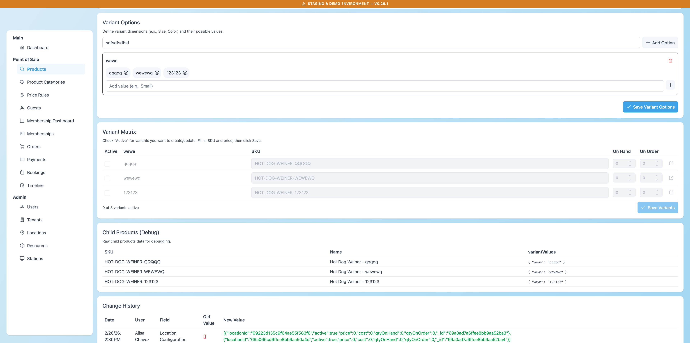
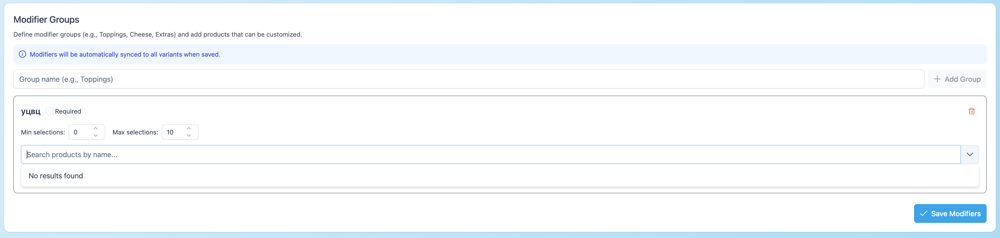

## 🐞 AIR-253: Changes not saved + cannot remove Variant Options (Hot Dog Weiner)

### Environment
Staging

### Test Data
Product: **Hot Dog Weiner**

---

## Description

There are issues with deleting data in product configuration.

### 1. Changes are not saved

- Modifier Groups and Modifier Presets can be removed in UI
- But after:
  - clicking **Save**
  - refreshing page
  - reopening product  
→ they appear again

Deletion works only in UI, but is not saved on backend.

---

### 2. Cannot remove Variant Options

- If Variant Matrix / child products exist:
  - Variant Options cannot be deleted

Errors:

- `Cannot Remove – X child product(s) use this option`
- `Cannot Remove – X child product(s) use this value`

User is blocked and cannot update variants.

---

### 3. Dropdown issue (Modifier Groups)

- Shows `No results found` by default
- Options appear only after typing

---

## Steps to Reproduce

1. Open product **Hot Dog Weiner**
2. Remove Modifier Groups / Presets
3. Click **Save**
4. Refresh page or reopen product

---

## Actual Result

- Deleted data comes back
- Variant Options cannot be removed
- Dropdown is confusing

---

## Expected Result

- Deleted data stays deleted
- Variant Options can be removed (or clear instruction why not)
- Dropdown shows options or hint (e.g. "Type to search")

---

## Severity / Priority

- Severity: High
- Priority: High

## Screenshots

### Modifier Groups reappear after save

### Variant Options error

### Dropdown issue

