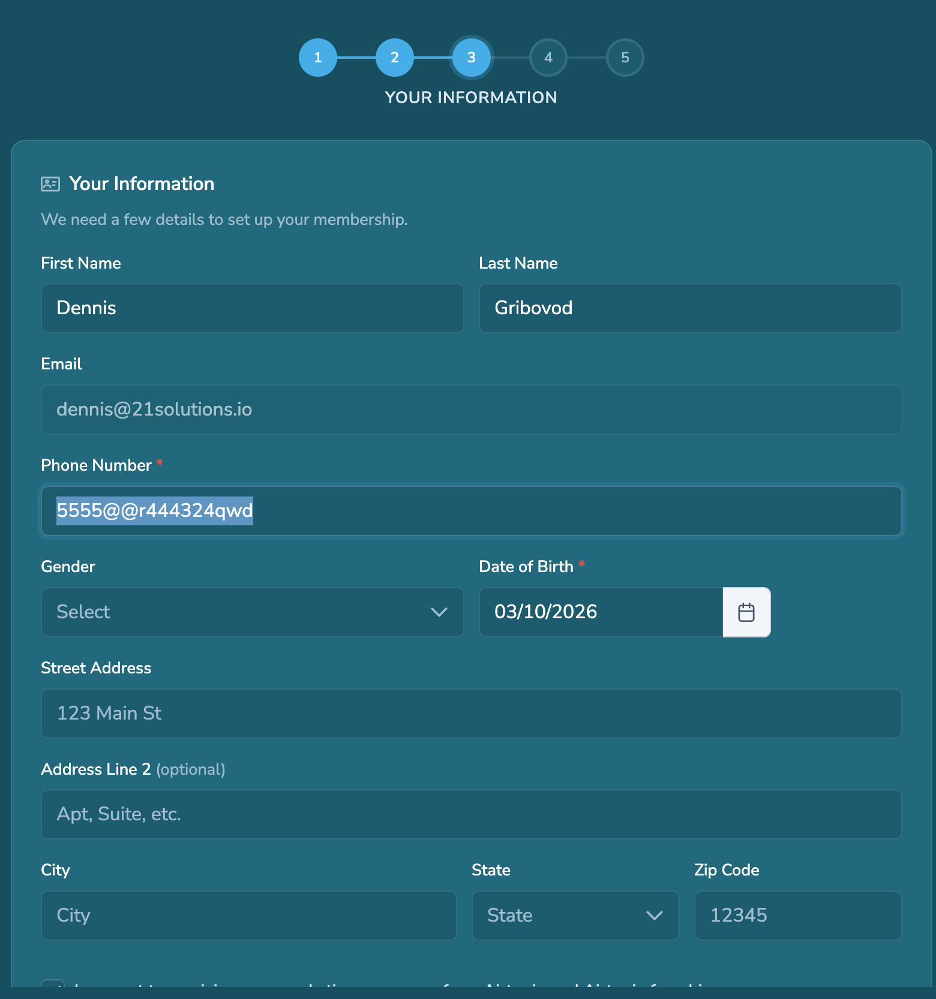
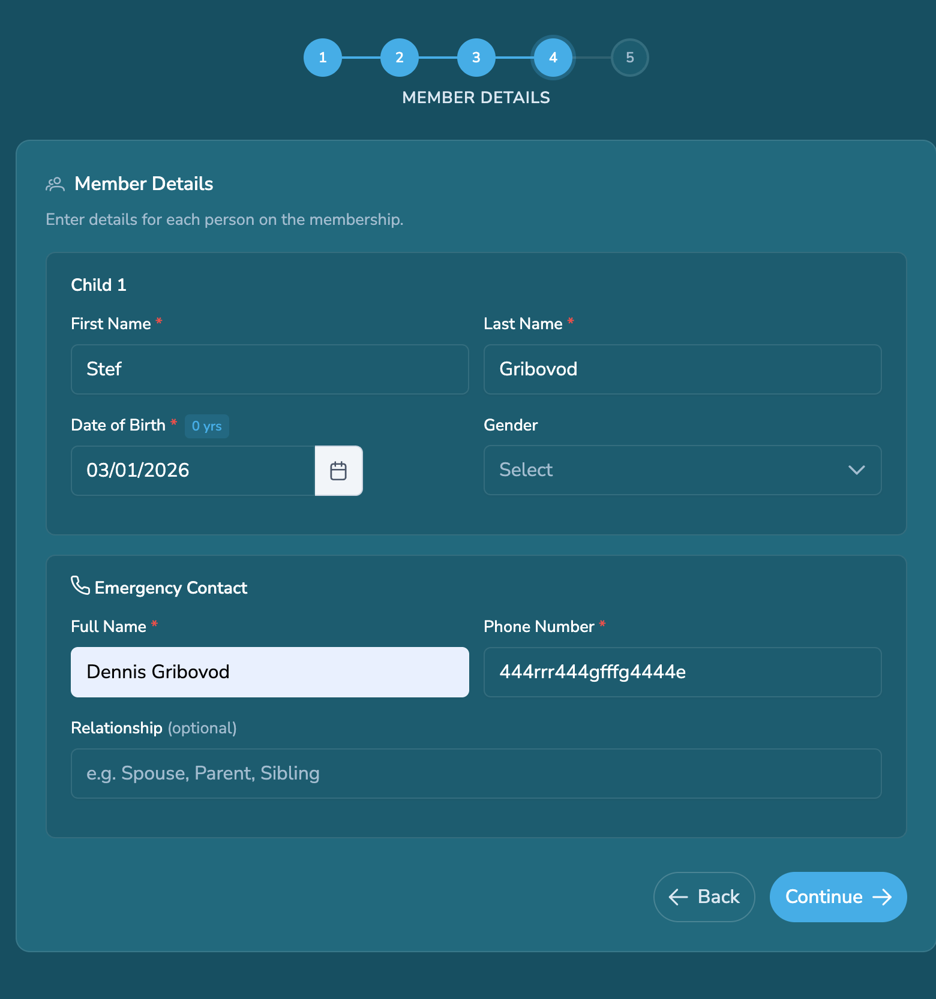
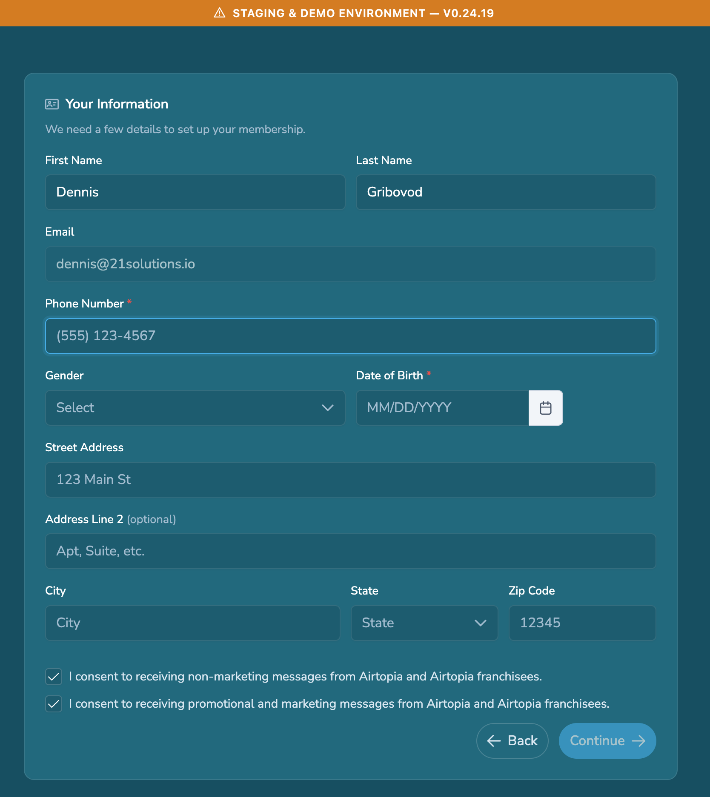

# Bug Report – Invalid Phone Number Accepted in Guest Membership Flow

## Environment

URL: https://staging.airtopiaparks.com/guest/explore/memberships
Device: Mac mini (Apple M4)
OS: macOS
Browser: Google Chrome

## Summary

The phone number field validation appears incorrect. The field accepts up to 16 characters including letters and special characters, and the user can still proceed to the next step with an invalid phone number.

## Steps to Reproduce

1. Open the Guest Explore Memberships page.
2. Start the membership signup flow.
3. Enter an invalid phone number (letters or symbols).
4. Continue to the next step.

## Actual Result

The form allows the user to proceed even with an invalid phone number.

## Expected Result

The system should restrict the phone field to a valid numeric phone format and prevent proceeding until a valid number is entered.

## Potential Impact

Users may be able to complete the membership purchase without a valid contact phone number.

## Testing Notes

Payment step was not verified because no test payment card was available.
## Attachments

### Step 3 – Invalid phone number entered

### Step 4 – System allows proceeding with invalid phone number

---

## Retest Findings – Missing Phone Number and Birth Date Validation

During additional testing, it was discovered that the system may still allow a membership purchase without a phone number and birth date in certain flows.

### Scenario 1 – Profile Editing Bypass

Steps to Reproduce:

1. Create a Guest account and purchase a membership.
2. Open the Guest Profile.
3. Remove the **Phone Number** and **Birth Date** fields.
4. Continue with the membership purchase process.
5. Complete checkout using a test card.

Test Card Used:  
4242 4242 4242 4242

**Actual Result**

The order was successfully completed **without a Phone Number and Birth Date**.

**Expected Result**

The system should require **Phone Number and Birth Date** before allowing membership purchase or checkout.

---

### Scenario 2 – Guest Widget Validation (Works Correctly)

URL:  
https://staging.airtopiapark.com/widget/test.html

Steps:

1. Open the Guest Widget.
2. Select **Priority SkyPass**.
3. Click **Continue**.
4. Leave **Phone Number** and **Birth Date** empty.

**Actual Result**

The system **does not allow proceeding** to the next step without filling these fields.

**Result**

Validation appears to **work correctly in this flow**.

---

### Scenario 3 – New Account Flow (Safari)

Steps to Reproduce:

1. Open the site in **Safari**.
2. Create a **new Guest account**.
3. Purchase a membership.
4. Leave **Phone Number** and **Birth Date** empty.
5. Complete the order.

**Actual Result**

Membership purchase was completed **without Phone Number and Birth Date**.

**Expected Result**

Phone Number and Birth Date should be **required for account creation or membership purchase**.

---

## Additional Notes

Validation behavior appears **inconsistent across different flows**:

- Guest Widget → validation works
- Profile editing → validation bypass possible
- New account flow (Safari) → validation bypass possible

This suggests that **backend validation may be missing or not enforced consistently**, and validation may currently rely only on certain UI flows.

## Additional Attachments

### Scenario 1 – Profile without Phone Number and Birth Date

### Scenario 2 – Guest Widget requires Phone Number and Birth Date

### Scenario 3 – Membership purchase without required fields (Safari)
****
